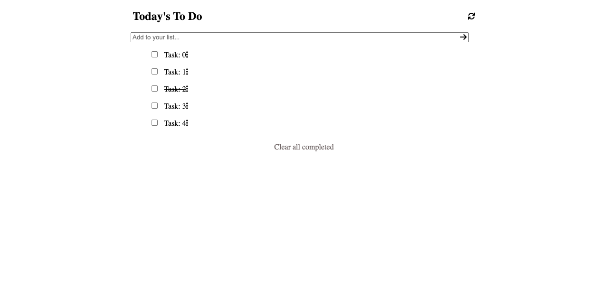

# To Do List

> This project consists of building a simple and functional to-do list.

Final version of the app would include; adding, removing, and completing tasks features.

## Built With

- Javascript
- Webpack
- EcmaScript 6

## Live Demo

[Live Demo Link](https://yigitm.github.io/todo-list/)

## Getting Started

### Usage

By clicking the live demo link you can access to projects's landing page.

You can add/remove and complete tasks. You cna mark the tasks as completed.

## Authors

👤 **Yigit Mersin**

- Github: [@yigitm](https://github.com/yigitm)
- Twitter: [@yigitmersin](https://twitter.com/ygtmrsn)
- Linkedin: [ygtmrsn](https://www.linkedin.com/in/yigitmersin)

## 🤝 Contributing

Contributions, issues, and feature requests are welcome!

Feel free to check the [issues page](https://github.com/yigitm/todo-list/issues).

## Show your support

Give a ⭐️ if you like this project!

## Acknowledgments

- 

- Open source

## 📝 License

This project is [MIT](./MIT.md) licensed.
